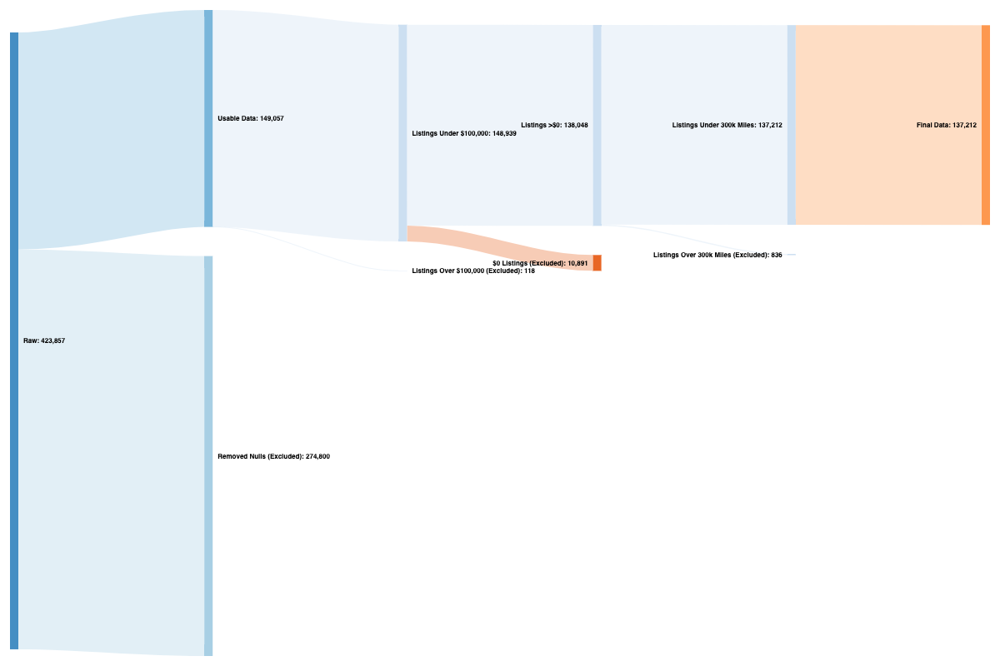

# Craigslist-ETL
A project I designed to practice ETL using Python and SQL. 

`craigslist-etl-first-try.ipynb` is my first attempt at cleaning up this data set. After trying to build a dashboard with the data, I decided to re-do the effort, leaving in more columns while ending up with a smaller, more usable number of listings. 

The second and final attempt can be found in `craigslist_cars-etl.ipynb`.

Here are the results of the ETL pruning process.

Here is a  to the dashboard I created in PowerBI. You can view this live on my 
